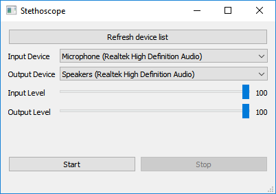
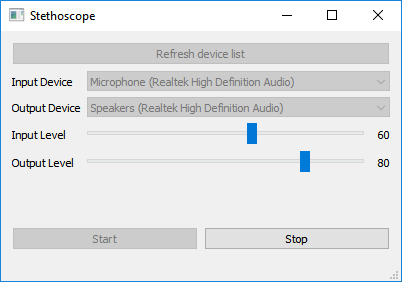

# Stethoscope
Audio loop-back with interface selection using Qt.

I created this to easily listen to different audio inputs with the ability to quickly change device and volume.  
Currently only tested on Windows 10, but should work on all platforms.

The current version is based on Qt 5.12.0, so I added a personal and temporary fix to QTBUG-75781.
